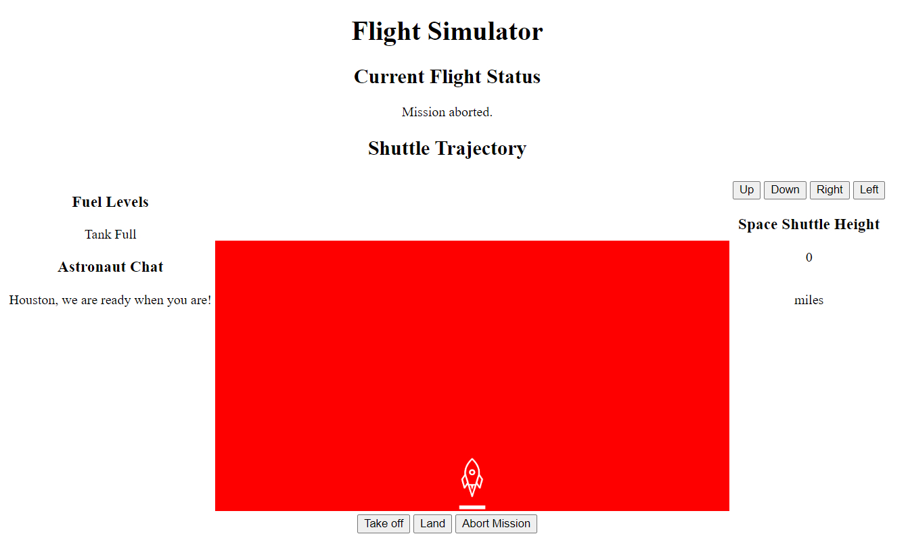

A script that lets the user control the movement of a tiny rocket on their web browser. The script uses JavaScript DOM-Maniuplation and HTML/CSS to accomplish this. This shuttle accepts three commands: launch, land, and abort. The shuttle can also be moved manually, horizontally and vertically.

Screenshots and demo can be found below.

*This program was a homework assignment at LaunchCode's Lc101 (2019)*

# Demo (Animated)

# Default View

# Confirm Launch

# Launch Result

# Confirm Land

# Land Result

# Confirm Abort (Mid-flight)

# Abort Results

